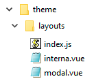

# Layouts

Os layouts fazem parte do tema e são responsáveis por definir e controlar quais as possibilidade de estrutura de uma página.

Dentro dessas opções (ou seja, dentro dos `slots` do layout) você precisa adicionar uma [sessão](./sessoes).

Veja a lista de layouts disponíveis no tema:

  - [Layouts](#layout-modal)
  - [Interna](#layout-interna)

## Estrutura de arquivos

A arquitetura física dos arquivos de layout devem respeitas o padrão abaixo:



                               
## index.js

No arquivo `index.js` é onde todos os layouts são declarados, como no exemplo abaixo:

``` js
import Vue          from 'vue'

import l_modal      from './modal.vue';
import l_interna    from './interna.vue';

Vue.component('l-modal',        l_modal);
Vue.component('l-interna',      l_interna);
```

---

## Layout Modal

O layout modal é normalmente utilizado para páginas específicas com alguma informações única, como por exemplo uma página de login.

### Propriedades
 - `width` - Define em pixels a largura do escopo do conteúdo do modal. (padrão `800`)

 ### Slots
- `default` - O único espaço da tela, que terá o conteúdo esperado.

---

 ## Layout Interna


 ### Slots
  - `cabecalho` - Espaço no topo do layout. Normalmente utilizada para o cabeçalho.
- `barra-esq` - Barra lateral (sidebar) que fica no lado esquerdo do layout.
- `barra-dir` - Barra lateral (sidebar) que fica no lado direto do layout.
- `conteudo` - É o miolo da página, onde necessariamente fica o conteúdo dela.
