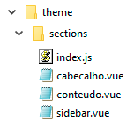

# Sessões

As sessões são estruturas que podem ser usadas dentro dos `slots` dos [layouts](./layouts.md).

Veja a lista de sessões disponíveis no tema:

 - Cabeçalho
 - Conteúdo
 - Sidebar 

 ## Estrutura de arquivos

A arquitetura física dos arquivos de sessão devem respeitas o padrão do exemplo abaixo:

---

## Sessão Cabeçalho

Essa sessão foi desenvolvida para ser utilizada exclusivamente no _slot_ "cabeçalho" do [layout Interna](./layouts.md#layout-interna).
Ela não dispõe de slots para inserções.

---

## Sessão Conteúdo

Essa sessão foi desenvolvida para ser utilizada exclusivamente no _slot_ "conteudo " do [layout Interna](./layouts.md#layout-interna).

 ### Slots
- `default` - O único espaço da sessão, que terá o conteúdo esperado;

---

## Sessão Sidebar
Essa sessão foi desenvolvida para ser utilizada exclusivamente nos _slots_ "sidebar-esq" (do lado esquerdo) e "sidebar-dir" (do lado direito) do [layout Interna](./layouts.md#layout-interna).

### Propriedades

 - **lado** `String` - Informe `direita` ou `esquerda` conforme o lado que o sidebar será incluído na página. (padrão: `esquerda`);
 - **barra_topo** `Boolean` - Especifica de deseja que apareça ou não a barra no topo do sidebar (é nessa barra que contém o botão "Minimizar". Se ela for ocultada o botão também será);
 - **botao_ocultar** `Boolean` - Especifica se ocontrole que ocula o sidebar estará disponível ou não;